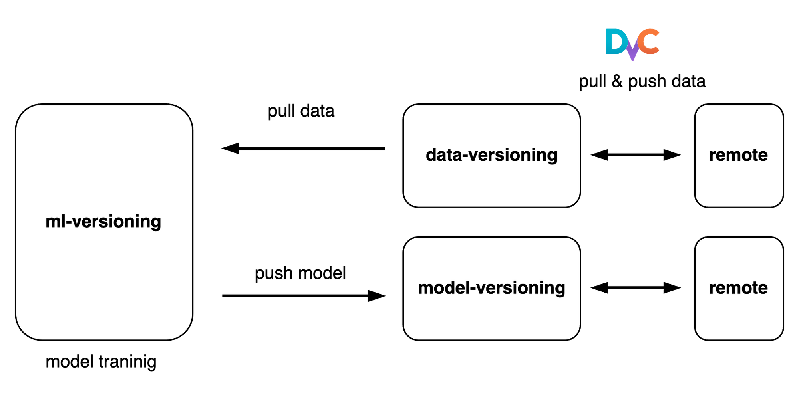

# ML Versioning with DVC



## Prerequisite

- Anaconda3


## Setup

Create conda env

```
$ make env
```

Activate conda env

```
$ source init.sh
```

Install `requirements.txt` and `requirementx-pip.txt`

```
$ make setup
```


## Download data and train model

Use `dvc get` command to download mnist data from repository.

```
$ make mnist

dvc get https://github.com/RRoundTable/data-versioning dataset
mkdir -p dataset/MNIST/raw
mv dataset/*ubyte dataset/MNIST/raw

$ tree dataset

dataset
└── MNIST
    └── raw
        ├── t10k-images-idx3-ubyte
        ├── t10k-labels-idx1-ubyte
        ├── train-images-idx3-ubyte
        └── train-labels-idx1-ubyte
```

Run train with 10 epochs and 0.1 limit batches.

```
$ make train

python src/main.py fit --config configs/small_train.yaml  --trainer.limit_train_batches 0.1 --trainer.limit_val_batches 0.1
```

Check `lighning_logs` directory and find checkpoint.

```
$ tree lightning_logs

version_2
    ├── checkpoints
    │   └── epoch=9-test_loss=0.0653.ckpt
    ├── config.yaml
    ├── events.out.tfevents.1662336863.wontakui-MacBookPro.local.95538.0
    └── hparams.yamlsss
```


## Make a new model and commit on git

Run new train and generage new checkpoints.

```
$ make train
```

Copy model to `model-versioning`

```
$ cp -r lightning_logs/version_0/ model-versioning/checkpoint
```

Add to dvc and commit in submodule `model-versioning`.

```
$ dvc add checkpoint
$ dvc push -r localstorage
$ git add checkpoint.dvc
$ git commit -m "save model v1"
```

## Reference

[1] [lightning mnist example](https://github.com/Lightning-AI/lightning/blob/master/examples/convert_from_pt_to_pl/image_classifier_5_lightning_datamodule.py)

[2] [Get Started: Data Versioning](https://dvc.org/doc/start/data-management)
